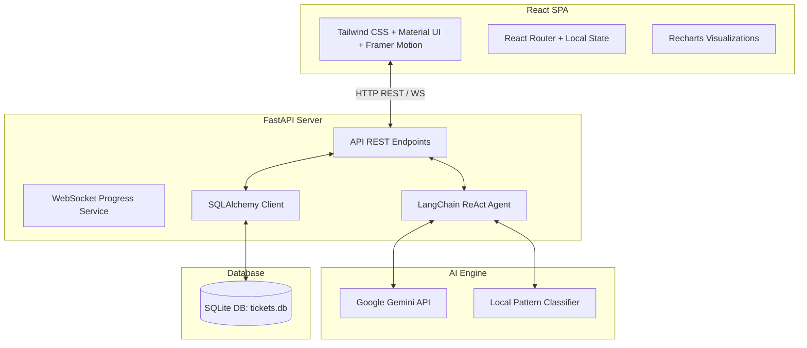

# AI Support Ticket Triage Agent Platform (Version 1.0)

The **Ticket Triage Agent** is a full-stack, AI-powered web application designed to automate customer support workflows by classifying and prioritizing support tickets. 

Utilizing **FastAPI** on the backend, **React** on the frontend, and a dual-engine **LangChain + local rule-based pattern matching classifier**, it reads incoming tickets, categorizes them, sets urgency levels, generates clear rationales, and displays live metrics in an interactive SaaS dashboard.

---

## 1. Core Feature Highlights
- **Smart AI Categorization**: Automatically groups support inquiries into `Bug`, `Billing`, `Feature`, or `Other`.
- **Urgency Tagging**: Flags tickets into four priority levels (`P1 Critical`, `P2 High`, `P3 Medium`, `P4 Low`).
- **AI Rationale Logs**: Generates reasoning logs explaining the AI's categorization logic.
- **Dual-Mode AI Engine (Failsafe)**: Runs out-of-the-box using a local rule-based regex analyzer (offline demo mode) and switches to official **Google Gemini** models using **LangChain** once an API Key is set in Settings.
- **WebSocket Ticket Streaming**: Broadcasts live progress metrics (`Reading Ticket...`, `Determining Category...`, etc.) via WebSockets.
- **Comprehensive Analytics**: Renders dynamic Recharts diagrams (Category distribution pie chart, Priority bar chart, incoming volume trend curves).
- **Interactive AI Chat Assistant**: Offers a floatable chat bot to query database statistics (e.g. *"Show recent bug tickets"*).
- **Interactive Triage Overrides**: Allows agents to manually adjust ticket category and priority tags in results table views.
- **Excel & Database Exports**: Offers instant downloads for CSV tables, JSON arrays, and SQLite binary database files.
- **Premium Glassmorphic Design**: Tailored visual experience with fully integrated class-based Dark and Light modes.

---

## 2. Technical Architecture



---

## 3. Database Schema (SQLite)

### Table: `tickets`
| Column Name | Database Type | Description |
| :--- | :--- | :--- |
| `id` | INTEGER | Primary Key, Auto-increment |
| `ticket_id` | VARCHAR | User-supplied ticket code (e.g. TC-4829) |
| `title` | VARCHAR | Support ticket summary title |
| `description` | TEXT | Detailed description of the user issue |
| `category` | VARCHAR | Bug, Feature, Billing, or Other |
| `priority` | VARCHAR | P1 Critical, P2 High, P3 Medium, P4 Low |
| `reasoning` | TEXT | Text reasoning generated by the AI classifier |
| `confidence` | FLOAT | Confidence quotient metric (0.0 to 1.0) |
| `processing_time`| FLOAT | System classification delay in seconds |
| `created_at` | DATETIME | ISO timestamp of record creation |

---

## 4. API Endpoint Reference

| Method | Endpoint | Payload / Params | Description |
| :--- | :--- | :--- | :--- |
| **POST** | `/api/upload` | JSON file attachment | Uploads JSON list of tickets to parse and validate, returning a preview list. |
| **WS** | `/api/ws/process` | WebSocket connection | Initiates live AI agent triage. Broadcasts logs and saves final results to database. |
| **GET** | `/api/results` | `page`, `limit`, `search`, `category`, `priority` | Fetches classified ticket records (supports sorting, pagination, and filters). |
| **GET** | `/api/ticket/{id}`| Path integer parameter | Returns details and raw JSON payload for a single ticket. |
| **PUT** | `/api/ticket/{id}`| Category & priority JSON | Overrides the ticket's category or priority flags. |
| **GET** | `/api/stats` | None | Returns database aggregates, average confidence, delays, and percentages. |
| **POST** | `/api/chat` | Message string | Queries database logs using natural language to answer support queries. |
| **GET** | `/api/export/csv` | Optional filters | Streams and downloads database records as an Excel-compatible CSV file. |
| **GET** | `/api/export/json`| Optional filters | Downloads database records as a structured JSON array. |
| **GET** | `/api/export/database`| None | Downloads the binary SQLite `tickets.db` database snapshot. |
| **GET** | `/api/settings` | None | Returns active model, prompt settings, and masked API key configurations. |
| **POST** | `/api/settings` | Prompt / Key configurations | Persists updated custom prompt definitions or Google API keys. |

---

## 5. Directory Structure
```
/ (Workspace Root)
├── backend/
│   ├── app/
│   │   ├── __init__.py
│   │   ├── main.py            # FastAPI main controllers & endpoints
│   │   ├── config.py          # Environment settings loader
│   │   ├── database.py        # SQLAlchemy connections
│   │   ├── models.py          # SQLite database schema models
│   │   ├── schemas.py         # Pydantic request-response schemas
│   │   ├── agent.py           # LangChain structured Gemini & Mock Agents
│   │   └── seed.py            # Database seeding script (100 sample tickets)
│   ├── requirements.txt       # Python dependencies configuration
│   ├── test_main.py           # Endpoint integration unit tests
│   └── tickets.db             # Active SQLite database file
├── frontend/
│   ├── src/
│   │   ├── components/        # Sidebar, Navbar, AI Chat Assistant
│   │   ├── context/           # Dark/Light Mode Theme Provider
│   │   ├── pages/             # 10 dashboard screens
│   │   ├── App.jsx            # Routing and layouts setup
│   │   ├── main.jsx           # Mounting entrypoint
│   │   └── index.css          # Tailwind directives, animations & Google fonts
│   ├── package.json           # Frontend NPM dependencies
│   ├── tailwind.config.js     # Tailwind grid layouts & themes
│   └── vite.config.js         # Vite bundler configurations
├── data/
│   └── sample_tickets_100.json# Generated sample support ticket dataset
├── README.md                  # System overview documentation
└── INSTALLATION.md            # Port setup and deployment guide
```

---

## 6. Project Engineering Team
- **Praveen Kumar** — Full Stack Lead & AI Orchestration
- **Aditya Raj** — Frontend Systems & UI/UX Styling
- **Sneha Sharma** — QA Test Engineering & Database Management
